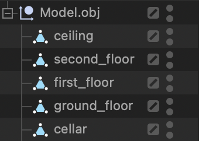
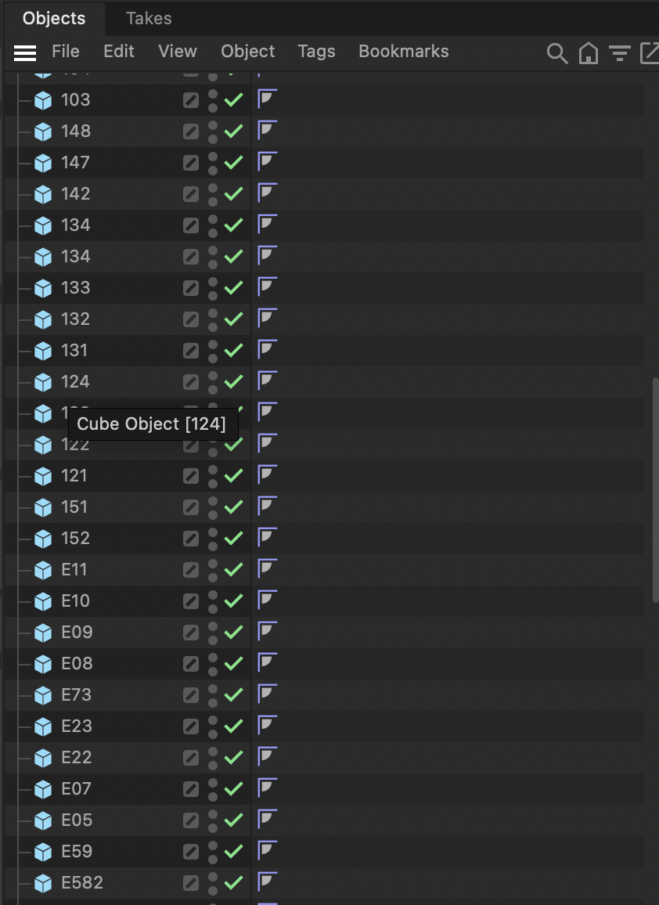
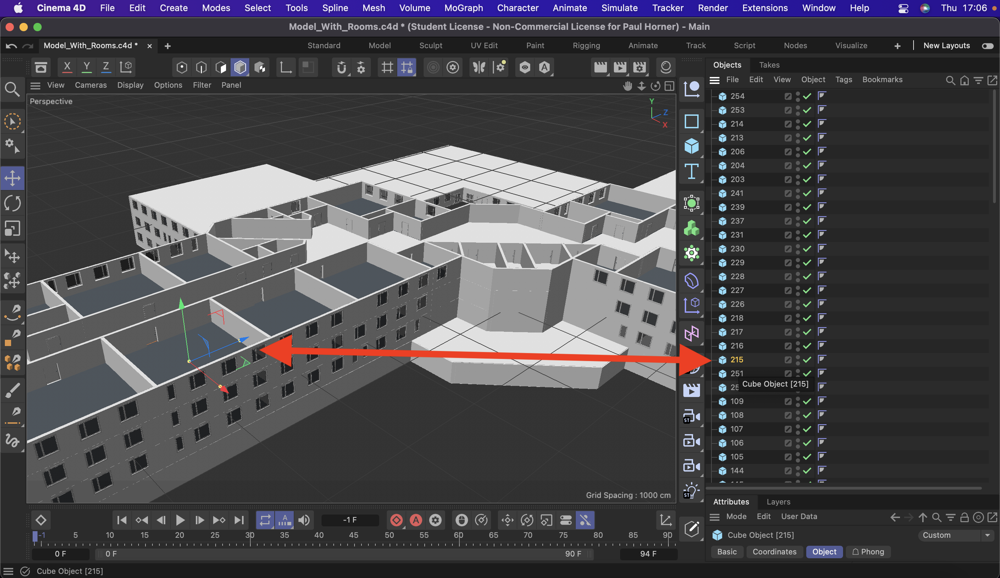
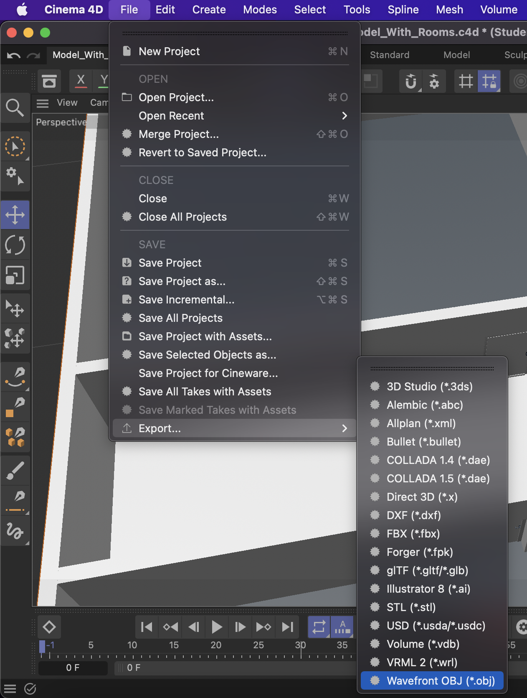

= Box für bestimmten Raum Konfigurieren und Neue Räume hinnzufügen
Paul Horner
1.0.0, 2020-01-29:
:toc: left
:sectnums:

== Leobox für gewissen Raum zuweisen

=== Sensorbox in WLAN konfigurieren

* Sensorbox öffnet einen Accesspoint EPS-32
wenn sie sich mit keinem Netzwerk verbinden kann.

* Mit Accsess Point verbinden

* Sensorbox wartet unter http://192.168.4.1

* WLAN-Credentials eingeben

** http://192.168.4.1/config

** http://192.168.4.1/config?thingname=eg/e74
*** floor/roomnumber

** http://192.168.4.1/config?ssid=????

** http://192.168.4.1/config?password=???

* Mqtt mit Authentication und Verschlüsselung

** http://192.168.4.1/config?mqttbroker=mqtts://leobw.synology.me

** http://192.168.4.1/config?mqttuser=????

** http://192.168.4.1/config?mqttpassword=????

** http://192.168.4.1/config?mqttport=8883

link:https://drive.google.com/file/d/1lFtku4dFRcFErO_S5FD6Z4YTc96Rxv16/view[Weitere Dokumentation]

== Zugriff auf 3D-Modell in Angular

=== Zugriff auf .obj Datei in Angular

==== Schritte:

* Nutzen von `three.js`-Bibliothek in Ihrem Angular-Projekt.
* Verwenden Sie den `OBJLoader` von `three.js`, um die `.obj`-Datei zu laden.
* Für Interaktionen mit dem Modell (wie das Klicken oder Ziehen des Modells) können Sie `THREE.Raycaster` verwenden.

link:https://threejs.org/docs/index.html#manual/en/introduction/Creating-a-scene[Three.js]

=== Wie sind Räume Definiert
=== Raum zuweisung in Angular-Client
==== Klasse: Loader

* `modelName`: Der Name des zu ladenden Modells.
* `scene`: Die Szene, in die das Modell geladen wird.
* `objects`: Ein Array, das alle Objekte in der Szene speichert.
* `objectArr`: Ein Array, das alle Children des geladenen Objekts speichert.
* `floors`: Ein Array, das die Namen aller Bodenobjekte speichert.
* `finishLoadingCallback`: Eine Callback-Funktion, die aufgerufen wird, wenn das Laden abgeschlossen ist.
* `floorObject`: Ein Array, das alle Bodenobjekte speichert.

==== Laden der Assets und des Models

Diese Methode lädt die Materialien (`.mtl`) und das Modell (`.obj`) mit Hilfe des `MTLLoader` und `OBJLoader`.
Nach dem Laden des Modells wird es zur Szene hinzugefügt und seine Kinder werden zum `objectArr` hinzugefügt.
Schließlich werden alle Kinder der Szene zum `objects` Array hinzugefügt.

==== Methode: generateLoadingManager

In der `onLoad`-Funktion des `LoadingManager`:

* `roomObject`: Dieses Array wird gefiltert, um nur die Elemente zu behalten, deren Name mit 'U', '1', '2' oder 'E' beginnt.
Dies könnte eine Konvention sein, um Räume in den Modellnamen zu kennzeichnen.

** *Im 3d-Modell sind die Raum-Objekte genau so gekennzeichnet/bennant*

* `floorObject`: Dieses Array wird gefiltert, um nur die Elemente zu behalten, deren Name mit 'c', 's', 'f' oder 'g' (cealing,
secondfloor, firstfloor) beginnt.

** *Im 3d-Modell sind die Stockwerk-Objekte genau so gekennzeichnet/bennant*

== Neue räume 3D Modell hinnzufügen

* Bearbeitung im 3D-Modell durchführen
* Raum Objekte nach Naming-Convention benennen
** BSP (E73, 111, 232)

* Exportireren in `.obj` Datei

* Datei in Assets ordner Kopieren
** Wenn nötig weitere änderungen im Angular-Code vornehmen
